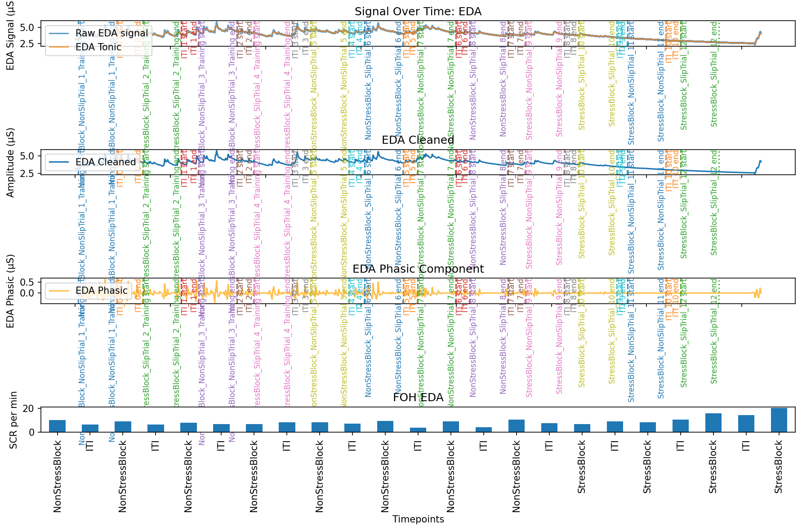

# EDA & Skin Conductance Responses (SCRs)

[Interval QC Plot](interval-qc.md) covered how trial *timing* is worked
out. This page covers what actually happens to the physiology signal once
those trial intervals exist: EDA processing, in `processing/eda.py`.

## What is EDA, and what's an SCR?

**EDA** (electrodermal activity) is the electrical conductance of the skin,
measured at the fingers or palm. It changes slightly as sweat glands
activate — and sweat gland activity is controlled by the sympathetic
nervous system, the same system involved in stress/arousal responses. In
practice, EDA is used as a proxy for physiological arousal.

EDA has two components:

- **Tonic** — the slow-moving baseline level, drifting gradually over
  minutes.
- **Phasic** — fast, short-lived bumps on top of that baseline, each one a
  **Skin Conductance Response (SCR)**. These are "the little bumps": brief
  spikes triggered by a specific, arousing event (a stressor, a startling
  moment, a stimulus in a task).

This pipeline counts SCRs per trial interval, as **SCRs per minute** — more
SCRs per minute suggests more arousal during that interval.

!!! note "Going further"
    For a fuller (but still accessible) introduction to EDA and SCRs, see:
    *Electrodermal activity - a beginner's guide*, available on ResearchGate:
    <https://www.researchgate.net/publication/346496084_Electrodermal_activity_-_a_beginner%27s_guide>
    (see that page for full authorship and publication details).

## What `eda.py` actually does

The processing chain, from raw signal to one row of output:

1. **Slice** — `run_eda_intervals` uses `trial_intervals.slice_data_frame`
   to cut the full EDA recording into one chunk per trial interval (the
   `TrialIntervals` object from the interval-matching step covered on the
   previous page).
2. **Clean, decompose, find peaks** — for each interval,
   `run_nk_eda_processing` wraps three [NeuroKit2](#the-neurokit2-toolbox)
   calls in order: `nk.eda_clean` (remove noise) → `nk.eda_phasic` (split
   into tonic/phasic components) → `nk.eda_peaks` (detect SCRs in the
   phasic component).
3. **Count** — `get_eda_data_out` counts detected SCR peaks for that
   interval and divides by the interval's length in minutes, producing one
   `..._SCR_per_min` value.
4. **Tidy column names** — `correct_order` cleans up the resulting column
   names so repeated interval labels (e.g. two `ITI` columns) don't
   collide.
5. **QC plot** — separately, `run_eda_qc` runs the *same* cleaning/decompose
   steps over the **whole, unsliced** recording (not per interval) purely to
   draw the QC figure below — it doesn't feed into the numeric output.

## Example QC plot

| Row | Title | What it shows |
| --- | --- | --- |
| 1 | *Signal Over Time: EDA* | Raw EDA signal, with the tonic (slow baseline) component overlaid. Vertical dashed/dotted lines mark each trial interval's start/end, from the interval-matching step. |
| 2 | *EDA Cleaned* | The signal after `nk.eda_clean` — noise removed. |
| 3 | *EDA Phasic Component* | The fast-moving phasic component after `nk.eda_phasic` — this is where individual SCRs (the bumps) are visible and detected. |
| 4 | *(bar chart)* | One bar per trial interval: the final `SCR_per_min` value that row 3 turns into. |

!!! note "Going further"
    The bottom row's title reads **"FOH EDA"** even in this Crane example —
    that's a leftover label from when this plotting code was shared across
    experiments, not a sign anything's actually wrong with the data. Worth
    fixing in `plot_eda` (`eda.py`) at some point, but harmless for now.

## Where this fits as a strategy step

`ProcessEdaPhysiologyDataStrategyStep` (`eda.py`) is the concrete strategy
that satisfies `ProcessPhysiologyDataStrategyStep` from `pipeline.py` — see
[Design Patterns](design-patterns.md) for what that means. Like the
interval-matching step on the previous page, it has its own
`fallback_strategy`:

- **`ProcessEdaPhysiologyDataStrategyStep`** — the main path. Takes the
  already-matched `TrialIntervals` produced by the interval step and
  processes each labelled trial.
- **`ProcessEdaPhysiologyFallbackStrategyStep`** — used when no matched
  intervals are available. It derives its own raw, unlabelled trigger
  intervals directly from the physiology data
  (`trial_intervals.get_raw_biopac_trigger_intervals`) and processes those
  instead — the same "partial data beats no data" idea as the interval
  step's fallback (see item 5 in
  [Next Steps](pipeline_next_steps.md#5-add-a-fallback-for-partialmissing-behaviour-data-using-unlabelled-intervals)).

## The NeuroKit2 toolbox

All the actual signal-processing math (cleaning, tonic/phasic decomposition,
peak detection) is done by [NeuroKit2](https://neuropsychology.github.io/NeuroKit/),
not custom code in this repo — `eda.py` is a thin wrapper that calls it with
this project's chosen methods (`clean_method="biosppy"`,
`peak_detect_method="vanhalem2020"`) and reshapes the result.

!!! note "Going further"
    Makowski, D., Pham, T., Lau, Z. J., Brammer, J. C., Lespinasse, F.,
    Pham, H., Schölzel, C., & S, H. A. C. (2021). NeuroKit2: A Python
    toolbox for neurophysiological signal processing. *Behavior Research
    Methods*, *53*(4), 1689–1696.
    [https://doi.org/10.3758/s13428-020-01516-y](https://doi.org/10.3758/s13428-020-01516-y)

---

**Next: [Lab Streaming (LSL/XDF)](lab-streaming.md)** — Crane's data
arrives as separate files; see how the FOH experiment's data arrives
instead, bundled into one `.xdf` recording.
