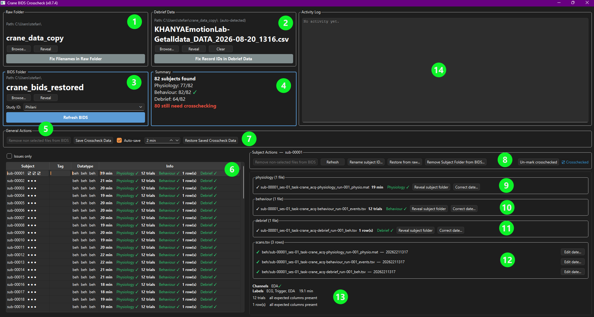

# FOH Crosscheck

This page is for anyone using the FOH Crosscheck tool to prepare data for
analysis — no coding background needed.

## What is "crosschecking"?

When a raw FOH recording session gets converted into the tidy, standardised
folder layout analysis expects (called "BIDS"), the conversion step doesn't
try to be clever about picking files. If a session was restarted, or there
are two recordings that could both plausibly be "the real one," the
converter just keeps all of them rather than guessing. That's deliberate —
guessing wrong and silently keeping the wrong file would be far worse than
leaving the decision to a person.

**Crosschecking is that person's job**: going through each subject's folder
and confirming — or fixing — which file is the right one, so everything
downstream can trust it without re-checking. It's a filing and bookkeeping
step, not a data-quality step (more on that distinction below). Critically,
it is a *bookkeeping* step in a very literal sense: the point of this tool
is never to change your raw data — it's to build up a written record of
every decision made about it, a record kept entirely separate from the raw
files themselves, so that record can always be checked, corrected, or
replayed from scratch. The FOH Crosscheck tool is a small program built
specifically to make that job fast: it shows you exactly which subjects
need a decision, gives you the information you need to make it, and
remembers every decision so it never has to be redone.

!!! info "The raw folder is never changed — not once, not ever"
    Everything this tool does — picking a recording, tagging it, correcting
    a date or filename, even removing a subject from BIDS — happens only in
    the **BIDS folder** and its own bookkeeping files. Your **raw folder**
    is opened for reading only: nothing on this page ever writes to it,
    renames anything in it, or deletes anything from it. That's true of
    every button on this page, however it's worded — something like
    **"Correct filename..."** or **"Fix raw filenames..."** only corrects
    how a name gets *read* when building BIDS from raw, never edits
    anything on disk in the raw folder itself.

    That one rule is what makes everything else on this page safe. Because
    every decision is *recorded* — never irreversibly baked into a renamed
    or deleted raw file — the entire BIDS folder, crosscheck decisions and
    all, can always be rebuilt from nothing but the raw folder plus those
    records. If the BIDS folder is ever lost, corrupted, or deleted by
    accident, nothing about your actual work is lost with it: see [Backing
    up, and rebuilding after a lost BIDS
    folder](#backing-up-and-rebuilding-after-a-lost-bids-folder).

## Why this matters for FOH data specifically

FOH sessions are recorded live, with real participants, real equipment, and
real interruptions — a recording might get restarted after a false start, a
laptop might reconnect mid-session and create a second file, or a test
recording might end up saved in the same folder as the real one. None of
that is unusual, and none of it is something a computer program can safely
sort out on its own — it takes a person who can look at when a recording
happened, how long it ran, and what it actually contains, and make the
call.

Left undone, this kind of ambiguity doesn't cause an obvious error later —
it causes *silent* problems: an analysis quietly running on a test file, or
on an earlier, incomplete attempt, with no error message anywhere to catch
it. Crosschecking front-loads that judgment call once, on purpose, instead
of leaving it to chance.

## How this is different from QC

It's easy to mix these two up, since both involve looking closely at a
recording — but they answer different questions, at different points:

- **Crosschecking** asks: *"Is this the right file, correctly labelled, and
  has someone recorded that this decision was made?"* It happens first,
  before any analysis, and it's what this page covers.
- **Quality control (QC)** asks: *"Is the data inside this file actually
  good?"* — clean signal, sensible trial timing, no equipment glitches.
  That's a separate, later step (see the [Interactive QC
  Plan](crane_interactive_qc_plan.md) for the sibling tool being built for
  Crane's version of this).

Crosschecking always happens first: there's no point quality-checking a
recording that turns out to be the wrong one.

## How to do a crosscheck

!!! tip "Not sure what a button or icon does?"
    Hover your cursor over any icon or button in the tool — a short tooltip
    explains what it does before you click it.

### 1. Open the tool

With your Python environment set up (see [Getting
Started](getting-started.md) if you haven't done this yet), open a terminal
and type:

```bash
vrlab_foh_bids_crosscheck
```

The tool remembers the last BIDS folder you had open, so after your first
time using it, it'll usually open straight to where you left off.

### 2. Point it at your raw folder and import

FOH recordings arrive from the recording software already named and laid
out the real BIDS way (`sub-XXX/ses-.../eeg/sub-XXX_ses-..._eeg.xdf`,
possibly with an `_old1`, `_old2`, ... suffix if a session was
restarted) — but that's still **raw** data: nobody's looked at it yet,
duplicates and all, and it hasn't been through the crosscheck decisions
below. To keep that raw data untouched while you work, this tool always
crosschecks a separate **BIDS folder**, and copies new subjects into it
from your **raw folder** on request rather than working on the raw
folder directly.

Click **Browse...** next to **Raw folder** and select the folder your
recordings actually land in, then click **Refresh BIDS**. This copies
every subject not already in your BIDS folder across, whole and
untouched — files already imported are never re-copied, overwritten, or
even looked at again, so a crosscheck decision you've already made (a
pick, a tag, a correction) can never be clobbered by re-running this.
Nothing in the raw folder is ever changed or deleted by this step. The
**Last conversion** panel below the subject details shows exactly what
the last click did — which subjects were added, which were already
there and skipped.

Safe to click any time, including repeatedly (e.g. once more recordings
have come in) — there's no harm in clicking it and finding nothing new.

Once a raw folder is picked, **Reveal Raw Folder** next to it opens that
folder in your system's file browser (Explorer on Windows, Finder on
macOS) — handy if you want to look at what's actually in there yourself.

### 3. Point it at your BIDS folder

If nothing loads automatically, click **Browse...** at the top and select
your FOH BIDS folder — the destination folder from step 2 above, not the
raw one. This is the folder every step from here on actually works with.
**Reveal BIDS Folder** next to it opens that folder in your system's file
browser, the same as **Reveal Raw Folder** does for the raw one.

The tool also makes sure a `.bidsignore` file at the top of that folder
lists its own files — `crosscheck.json`, `crosscheck_pending.json`,
`excluded_subjects.json`, and its cached recording info — appending to
`.bidsignore` if one already exists (without touching anything else in
it) or creating one if not, so a BIDS validator doesn't flag them as
unexpected.

### 4. Read the subject list

Above the list, a summary line gives you the folder's overall state at a
glance — total subject count, how many recordings were found — and, in
**bold red**, how many subjects still need crosschecking (i.e. haven't
been marked ☑ for every scan type). That count disappears once everyone's
been reviewed.

The left-hand panel lists every subject, with a small icon (or icons) next
to each one telling you, at a glance, whether it needs your attention:

| Icon | Meaning |
| --- | --- |
| ● | Fine — exactly one recording found, nothing to do. |
| ○ | Missing — no recording found at all for this subject. |
| ⚠ | Needs a decision — more than one recording was found. |
| ⏳ | You've picked one, but haven't saved that choice yet. |
| ☑ | You've personally reviewed and approved this one. |
| 🏷 | Whichever recording currently counts as "the one" hasn't been tagged foh yet. |
| ❗ | Whichever recording currently counts as "the one" has a flagged issue — a sampling-rate mismatch, or a missing EDA/ECG channel — worth a look before you commit to it. |

That last one matters even for a subject that otherwise looks fine (●) — a
single recording being *found* doesn't mean it was ever confirmed and tagged
as the real foh recording, so it stays flagged until you either tag it or
consciously decide it doesn't need to be. Tick **Issues only** and it'll show
up there too, alongside missing/duplicate subjects.

The **Tag** column shows, at a glance, whether the recording currently
counts as "the one" has been tagged yet — either the tag itself (e.g.
`foh`) once it has, or **not tagged** in orange if it hasn't (the same
thing the 🏷 icon flags, spelled out here so you don't have to hover the
icon legend to remember what it means).

The **Datatype** column shows which BIDS *datatype* folder that
recording's file currently lives in — `eeg` at first, since that's the
name the collection software always uses (see [step
12](#12-tag-files-with-real-bids-tags) for why that's not accurate for FOH data, and
what it becomes once tagged). "Datatype" is BIDS's own term for this —
the `eeg`/`beh`/`func`/... subfolder a recording sits in, not a filename
thing. Hover a value to see what it means and, if it's about to change,
what it'll change to.

The **Info** column next to it shows a quick summary for whichever
recording currently counts as "the one" — the date and time it was
recorded, how long it ran (in minutes), and how many of the streams the
pipeline needs were actually found, e.g. `Streams: 4/4 ✓` (or ✗ if any are
missing).
Hover over that summary for the full breakdown, stream by stream — so you
don't have to open a file yourself to get a sense of whether it's the
real one.

The tool remembers this per-recording info between launches, so
re-opening a folder you've already looked at is fast rather than
re-reading every recording from scratch. If a recording's actual file has
changed since the tool last read it, click **Refresh** in the **Subject
actions** panel (see below) to make it look again.

Tick **Issues only** above the list to hide every subject that's already
fine, so you only see the ones that need a decision.

### 5. Click a subject to see its details

The right-hand panel shows full detail for whichever subject is selected
on the left. If there's more than one recording, you'll see each one
listed with its own date, length, and stream information side by side, so
you can compare them directly.

(You can also select more than one subject at once — Ctrl-click or
Shift-click in the list — for bulk actions across your selection. See
[Working with several subjects at once](#working-with-several-subjects-at-once)
below.)

### 6. Pick the right recording

Click the button next to the correct recording. This doesn't save
anything yet — it's a preview, marked with the ⏳ icon, so you can change
your mind before committing to it.

### 7. Check the recording detail before saving

Once a recording counts as "the one" for a subject — either it was the
only candidate, or you've picked it with the radio button — a small panel
appears below the buttons with a fuller breakdown than the compact
summary in the subject list:

- Which of the streams the pipeline needs were found in this recording,
  each shown with its own tick or cross.
- For the `OpenSignals` stream specifically: the column names it reports
  (e.g. `nSeq, EDA0, ECG1`), whether the EDA and ECG channels the pipeline
  actually reads were found among them — matched even if the recording
  device added a trailing channel number, like `EDA0` or `ECG1`, rather
  than needing an exact name match — and its sampling rate, shown as
  *effective* (measured from the file's actual timestamps) versus
  *specified* (what the recording said it would be).

If the sampling rate disagrees by more than 10%, or either channel is
missing, that's shown in red, and the subject picks up a ❗ next to its
name in the subject list — worth a second look before you commit to it.

### 8. Save your decision

Once you're confident, click **"Remove non-selected files from BIDS"**
in the **Subject actions** panel (above the recording detail) — this
deletes the other recording(s) from your BIDS folder and records your
decision. Nothing is lost: the raw folder (step 2) is never touched by
this tool, so a removed recording is always still sitting there if you
ever need it back — see [step 14](#14-restore-or-revert-everything) to
bring it back into BIDS. It only appears enabled once you've actually
picked something; the button's label counts your pending picks so you
can see at a glance whether there's anything to save.

!!! note "Why delete instead of moving it aside?"
    Earlier versions of this tool moved a non-picked duplicate into a
    `crosscheck_review/` folder inside BIDS instead of deleting it. That
    turned out to be redundant: the raw folder is never touched by this
    tool either way, so it was already the recoverable copy. Deleting the
    BIDS-side copy keeps things simpler — there's just your raw folder and
    your BIDS folder, nothing in between.

    Nothing moves the moment you *pick* a candidate (step 6) — picking is
    just a preview. Files stay exactly where they are until you actually
    click a "Remove non-selected..." button.

If you've gone through several subjects and picked a recording for each
without saving as you went, you don't have to repeat that per subject —
click **"Remove non selected files from BIDS"** near the top of
the window to save everything you've picked in one go, or select just the
ones you want first and use **"Remove non-selected files from BIDS for
selected"** in the Subject actions panel instead (see [Working with
several subjects at once](#working-with-several-subjects-at-once) below).
Because either of those affects more than one subject at once, both ask
you to confirm before doing anything — the single-subject version above
doesn't, since it's already a deliberate one-at-a-time click.

!!! note "Didn't get to finish?"
    If you close the tool with picks still pending (still showing the ⏳
    icon), that's fine — they aren't lost. The tool remembers them and
    they'll still be there, still pending, next time you open it.

### 9. Mark a subject as reviewed (optional)

Above the recording detail, the **Subject actions** panel holds actions
that apply to the whole subject rather than one specific recording:
marking it reviewed, renaming its ID, re-reading its info from disk if a
recording has changed since the tool last looked (**Refresh**), undoing a
duplicate pick already committed (**Restore from raw...**, see [step
14](#14-restore-or-revert-everything)), and removing it from BIDS
entirely (see [step 13](#13-remove-a-subject-from-bids) below). It
stays visible at a fixed spot regardless of what's selected — blank when
nothing is selected, and titled with the subject's ID when exactly one
is, so there's no jumping around or losing track of who it applies to as
you click between subjects.

Click **"Mark crosschecked"** there to record that you've personally
looked at this subject and approved it — shown afterwards as a ☑ next to
its name in the subject list. This is a manual note for your own or your
team's reference; it doesn't change anything else. Click the same button
again ("Un-mark crosschecked") to remove the mark.

### 10. Look at the files yourself

Click **"Reveal subject folder"** next to a recording to open that
subject's folder — inside your **BIDS folder**, not the raw one — in
your system's file browser (Explorer on Windows, Finder on macOS) —
useful if you want to check something the tool doesn't show, or just
confirm what's actually sitting on disk.

### 11. Fix an obviously wrong date or ID

If a recording's filename has the wrong date in it, click
**"Correct date..."** next to it and type the right one. If a whole
subject's ID is wrong, use **"Rename subject ID..."** in the **Subject
actions** panel — this renames every file for that subject, plus their
folder, all at once. (This one's single-subject only: it doesn't appear
when several subjects are selected, since renaming several different
subjects to the same new ID wouldn't make sense.)

!!! note "Why don't I see \"Correct date...\" next to every candidate?"
    For a subject with more than one candidate recording, **"Correct
    date..."** (and **"Tag with foh BIDS tags"**, see below) only appears
    next to whichever one you've picked with the radio button — there's
    nothing to correct on a file you haven't confirmed is the right one
    yet. Pick it first (step 6), and the button appears.

### 12. Tag files with real BIDS tags

Once you're confident a recording is the right one, click **"Tag with
foh BIDS tags"** next to it. This inserts a `task-foh` entity (and an
`acq-lsl` entity, since this was collected over Lab Streaming Layer) just
before the `run-<NNN>` part of the filename, and replaces whatever comes
after it with the real BIDS suffix `beh` — so
`..._run-001_eeg_philani.xdf` becomes
`..._task-foh_acq-lsl_run-001_beh.xdf`, not
`..._run-001_eeg_philani_foh.xdf`. The collection software often tacks on
extra free text after the run number (a device suffix, a collector's
name), which isn't valid BIDS; tagging cleans that up at the same time as
marking the file, rather than tagging on top of it.

!!! note "What's the eeg -> beh folder switch about?"
    The folder the file lives in gets renamed too, from `eeg` to `beh` —
    you'll see this reflected immediately in the **Datatype** column
    (step 4). The raw collection software always names this folder `eeg`,
    no matter what's actually recorded in it. For FOH that's simply
    wrong: this is physiology data, sometimes with behavioural data,
    collected over LSL — not brain activity, not EEG. `beh` ("behavioural"
    in BIDS's own vocabulary) is the accurate datatype for that once a
    recording's confirmed, so tagging fixes the folder name at the same
    time it fixes the file name.

    Nothing else in that folder gets left behind: any other file still
    sitting there — an unresolved duplicate you haven't picked yet, say —
    moves along with the folder rather than being separated from it.
    Removing the tag (below) renames the folder back to `eeg`.

Tagged the wrong recording, or tagged one that turns out not to be a real
foh recording after all? The same button turns into **"Remove foh BIDS
tags"** once a file carries the tag — click it to restore the original
filename (the tool remembers what that was when it tagged the file, even
though it's no longer visible in the current name) and strip the tags
back off. The 🏷 icon comes back on that subject until you tag the right
one (or decide none of its candidates should be).

If you'd rather do this for every subject in one pass instead of
file-by-file, click **"Tag all selected with foh BIDS tags"** near the
top of the window (next to "Remove non selected files from BIDS"). It
walks every subject, tags whichever recording currently counts as "the
one," and skips anything already tagged — and, like "Remove non selected
files from BIDS," it asks you to confirm first since it touches every
subject at once. It only ever adds tags, never removes them, so an
accidental tag still needs undoing by hand with "Remove foh BIDS tags."

Only want to tag the subjects you've currently selected rather than the
whole folder? Select them in the subject list first, then use **"Tag
selected with foh BIDS tags"** in the **Subject actions** panel instead —
same behaviour, just scoped to your selection.

### 13. Remove a subject from BIDS

Sometimes a whole subject doesn't belong in the folder at all — a test
recording that got saved alongside real data, or someone who was never
really a participant. Click **"Remove Subject Folder from BIDS..."** in
the **Subject actions** panel — this deletes the subject's entire folder
from BIDS (their raw recording is untouched, and still sitting in the raw
folder from step 2) and asks you for an optional reason first, so it's
clear later why they were removed. Leave the reason blank and click OK if
you don't need to record one, or Cancel to back out without removing
anything.

If you removed the wrong subject, see [step
14](#14-restore-or-revert-everything) to bring them back.

### 14. Restore or revert everything

Made a mistake? How you undo it depends on what you're trying to take back:

- **Undoing just one subject's duplicate pick** — select that subject (or
  a few, with Ctrl-click) and click **"Restore from raw..."** (or
  **"Restore selected from raw..."** for more than one) in the **Subject
  actions** panel. This only works for a subject who's still visible in
  the list with a duplicate already resolved (step 8) — it clears the
  bookkeeping for just them, leaving every other subject's decisions
  untouched, so click **Refresh BIDS** (step 2) afterward to bring their
  full record back in fresh. Because it re-derives their *whole* folder,
  not just the one file that was removed, any other decision already made
  for them (a corrected date, a crosschecked mark, another scan type's
  pick) goes with it and needs redoing too.
- **Bringing back a subject removed entirely** (step 13) — a subject
  removed whole has no row left in the list to select, so there's no
  scoped way to reach just them yet. Use **"Restore all from raw
  folder..."** near the top of the window instead — it brings back
  *every* subject removed from BIDS, whole-subject removals and
  duplicate picks alike, the same way described above. Click **Refresh
  BIDS** afterward to actually bring the data back in.
- **"Revert all changes..."** reverses every recorded rename — corrected
  dates, corrected IDs, foh tags — and clears every recorded decision,
  including crosschecked marks.

!!! warning "Bulk only for whole-subject removals and renames, for this version at least"
    **"Restore all from raw folder"** and **"Restore selected from
    raw..."** cover the same kind of undo — bringing a subject's whole
    record back so it can be re-derived from raw — just at different
    scopes: everything removed, or a specific selection you can actually
    still see and click on. **"Revert all changes"** is bulk only,
    though: it reverses everything recorded, not just one decision — and
    only the *most recent* recorded decision for each subject/scan-type
    can be reversed, since each new correction overwrites the previous
    record rather than keeping a history. A recording that was, say,
    date-corrected and *then* tagged foh can only be reverted back to its
    date-corrected state, not all the way back to its very first
    filename.

    Subjects removed from BIDS aren't touched by "Revert all changes" —
    if you want everything back, restore those first.

### Backing up, and rebuilding after a lost BIDS folder

This is the payoff of the rule at the top of this page — **the raw folder
is never touched** — spelled out concretely: everything in your BIDS
folder is either raw data (already safe, and reproducible any time by
re-running "Refresh BIDS") or bookkeeping this tool writes as you work.
Only that bookkeeping is unique and worth backing up on its own: click
**"Backup crosscheck data..."** near the top of the window and pick a
folder — it copies the small set of files that record every decision
you've made, nothing more.

If the BIDS folder itself is ever lost or corrupted, click **"Rebuild from
backup..."**, pick the backup folder you made earlier, and confirm. This
re-imports fresh from your raw folder, then automatically replays every past
pick, tag, and correction from the backup — you don't redo any of it by
hand. It's only meant for a BIDS folder that's empty or was just freshly
created, not for merging a backup into one that already has its own,
different state. If anything couldn't be automatically matched back up (rare
— it means the raw data itself changed since the backup was made), you'll
get a summary of exactly what needs a manual look, rather than a silent gap.

!!! note "Want a completely fresh start instead?"
    There's no single "clear everything and start over" button in this
    tool, on purpose. Restoring and reverting (above) only ever undo
    *decisions* — they always leave your raw folder as the source of
    truth and re-derive from it, which is safe by design. A full wipe is
    a different, much blunter kind of action: it would throw away
    perfectly good, already-checked work for subjects who were never a
    problem in the first place, just to fix a handful that were. Building
    that safely (so a room full of people can't wipe real results with
    one stray click) is more machinery than it's worth for something you
    can already do yourself, just as safely, outside the tool: **point it
    at a brand-new, empty BIDS folder** (create one anywhere and click
    **Browse...** to it), or **delete the old BIDS folder yourself** and
    let **Refresh BIDS** rebuild it from scratch. Either way, your raw
    folder is never touched, so nothing is actually at risk — you're just
    choosing to throw away the BIDS-side bookkeeping and start over. This
    is especially handy for a test/practice BIDS folder while you're
    still learning the tool — delete it and start fresh as often as you
    like.

## Working with several subjects at once

Click a subject to select it, or Ctrl-click (or Shift-click for a range)
to select several at once. With one subject selected, the panel's title
shows their ID, so you always know who the buttons below it apply to;
with more than one, it switches to a **"Subject actions — N subjects
selected"** panel with bulk versions of the actions above: **Remove
non-selected files from BIDS for selected**, **Refresh**, **Tag selected
with foh BIDS tags**, **Mark selected crosschecked** / **Un-mark selected
crosschecked**, **Restore selected from raw...**, and **Remove selected
from BIDS...**.

Two things stay single-subject only, on purpose:

- **Renaming a subject's ID** — renaming several different subjects to
  the same new ID wouldn't make sense.
- **Picking which recording is the right one** for a subject with more
  than one candidate — that judgement call always stays in the
  per-subject recording panel, never a bulk action. A subject still
  waiting on that pick is simply skipped by any bulk action that needs an
  actual file to work with (e.g. **Remove non-selected files from BIDS
  for selected** or bulk FOH-tagging).

## A sibling tool for Crane

The Crane experiment has its own equivalent tool, `vrlab_crane_bids_crosscheck`
— same idea, same layout (including its own raw folder + "Refresh BIDS"
step), just checking `physiology`/`behaviour`/`debrief` files instead of a
single FOH recording, and its raw-to-BIDS step does real reshaping rather
than a plain copy (see [BIDS Converter Plan](bids_converter_plan.md) for
what differs).

### Crane's layout at a glance

Everything below is covered in detail in the numbered walkthrough further
up this page — this is just a quick, visual reference for where each part
lives on screen, numbered to match the screenshot:



| # | Panel / control | What it's for |
| --- | --- | --- |
| 1 | **Raw Folder** | Where your raw recordings live. Browse, Reveal, or fix a raw filename. |
| 2 | **Debrief Data** | The REDCap questionnaire export (Crane only — see [Fixing debrief record IDs](#fixing-debrief-record-ids)). |
| 3 | **BIDS Folder** | The folder you're actually crosschecking. **Refresh BIDS** pulls in any new subjects from the raw folder. |
| 4 | **Summary** | Subject counts per scan type, and how many still need a decision. |
| 5 | **General Actions** | Bulk actions across every subject: remove non-selected files, save crosscheck data, auto-save. |
| 6 | **Subject list** | One row per subject — icons show status at a glance (see [step 4](#4-read-the-subject-list)). |
| 7 | **Restore Saved Crosscheck Data** | Reload your most recently saved crosscheck session. |
| 8 | **Subject Actions** | Actions that apply to whichever subject is selected on the left (see [step 9](#9-mark-a-subject-as-reviewed-optional)). |
| 9 | **Physiology detail** | Full detail for the physiology recording — Reveal, or correct its date. |
| 10 | **Behaviour detail** | Same, for the behaviour recording. |
| 11 | **Debrief detail** | Same, for the debrief file. |
| 12 | **scans.tsv** | The BIDS bookkeeping file listing every scan for this subject, with its recorded date. |
| 13 | **Channel/label detail** | Channels found, trial count, and whether every expected column was present. |
| 14 | **Activity Log** | A running record of everything the tool has done this session. |

Everything else on this page applies to Crane too, with one difference: Crane's raw-to-BIDS step already writes real BIDS filenames
itself, so there's no "Tag with ... BIDS tags" step to do by hand (step
12) — instead, next to whichever recording currently counts as "the one,"
you'll see **"Correct filename..."**. Use it if something in the name
still looks wrong: a stray `-dup2` (or `-dup3`, ...) left over from two raw
files landing on the same name, a wrong `task-`/`acq-` entity, or anything
else you spot — type the corrected filename directly (keeping the same
file extension) and it's renamed, with any `scans.tsv` reference to it kept
in sync automatically.

Crane also has two extra raw-side correction dialogs near the top of the
window — **"Fix debrief record IDs..."** and **"Fix raw filenames..."** —
for declaring a corrected subject id where the raw data itself is
ambiguous. Both work the same basic way: a table of anything that looks
off, a box to type the correct subject id into, and nothing actually
changes until you click **Save** — leaving a box blank makes no change at
all for that row. Neither one ever edits your raw data; each saves its
corrections to its own file in the BIDS folder, applied the next time you
click **Refresh BIDS**.

### Fixing debrief record IDs

Crane's debrief (questionnaire) data comes from a REDCap export with a
`record_id` column that's supposed to be the subject's id — but since
it's typed in by hand, it sometimes doesn't quite match: stray spaces, a
spurious `.0` on the end, a missing dash, or two different subjects who
both happened to type the same id.

Click **"Fix debrief record IDs..."** to see every `record_id` that
doesn't cleanly match a known subject, or that's shared by more than one
row (each occurrence gets its own row here, labelled "1 of 2", "2 of 2",
etc., so you can tell them apart). For each row:

- **record_id (from export)** — the value as it actually appears in the
  export, unchanged.
- **Matched** — a quick ✓/✗ showing whether the id currently typed in the
  next column matches a subject who's still missing a debrief file.
- **Corrected subject id** — type the real subject id here. Rows that
  aren't shared with another row are pre-filled with a best-effort guess
  (whitespace trimmed, that spurious `.0` removed); rows sharing a
  `record_id` with another are left blank on purpose, since guessing the
  same subject for both would just recreate the ambiguity — you need to
  assign each one individually. A list of subject ids still without a
  debrief match is shown below the table as a reference while you do.

Leave a box blank to skip that row — it's fine for a subject to genuinely
have no debrief data (e.g. they never completed the questionnaire).
Click **Save** once every row you care about is filled in.

### Fixing incorrect raw filenames

Every raw physiology/behaviour file's subject id is normally read
straight from its filename. Occasionally that fails outright (the
filename doesn't match the expected pattern at all), or it succeeds but
lands on the wrong id — most often because of a `(N)` marker at the end
of the id, which is ambiguous on its own: it could mean a harmless second
copy of the same recording, or two genuinely different subjects who
happen to share a base id.

Click **"Fix raw filenames..."** to see every raw file, with a
**"Currently resolves to"** column showing the subject id it currently
maps to (or **"(unparseable)"**, in red, if it doesn't resolve at all).
Click a row to see, in the details pane below the table, plain-English
reasoning for why it failed (or what it resolves to if it didn't), plus
any matching line from the last time you ran **Refresh BIDS**. Type the
correct subject id into **"Corrected subject id"** for any row that's
wrong, then click **Save**.

This never renames the file itself on disk — only what the *next*
Refresh BIDS run resolves that filename to.

**"Backup crosscheck data..."**/**"Rebuild from backup..."** (see
[above](#backing-up-and-rebuilding-after-a-lost-bids-folder)) include
both of these correction files automatically for Crane, since a rebuild
needs them in place *before* Refresh BIDS runs, not just the decisions
made afterward.

---

**Also see:** [BIDS Crosscheck Plan](bids_crosscheck_plan.md) for the
original design decisions behind this tool, and [BIDS Crosscheck:
Architecture](bids-crosscheck-architecture.md) if you're looking to change
how it works rather than just use it.
