# FOH EDA Pipeline

This diagram follows the EDA path reached from `src/mooi_toolbox/cli/mobi_FOH_process.py` and shows the error checks currently present in the code.

```mermaid
flowchart TD
    A["CLI: mobi_FOH_process.main(xdf_fn, output_folder, verbose, show_plots)"] --> B{"output_folder provided?"}
    B -- "No" --> C["Set output_folder to Path(xdf_fn).parents[3] / '_out'"]
    B -- "Yes" --> D["Use provided output_folder"]
    C --> E{"output_folder exists?"}
    D --> E
    E -- "No" --> F["os.mkdir(output_folder)"]
    E -- "Yes" --> G["Continue"]
    F --> G
    G --> H["xdf_io.get_subject_id(xdf_fn)"]
    H --> I["run_foh_pipeline(xdf_fn, verbose, show_plots)"]

    I --> J{"xdf_fn provided?"}
    J -- "No" --> K["get_and_check_xdf(cfg.get_default_xdf(), verbose)"]
    J -- "Yes" --> L["get_and_check_xdf(xdf_fn, verbose)"]
    K --> M["gather_xdf_data_streams(streams, ['OpenSignals', 'VR_markers', 'VR_trial_events', 'FOH_target'])"]
    L --> M

    M --> N["missing_streams = required streams - gathered streams"]
    N --> O{"missing_streams?"}
    O -- "Yes" --> P["Log warning: Missing streams"]
    O -- "No" --> Q["Log info: No missing streams"]
    P --> R{"Missing VR_markers or VR_trial_events?"}
    Q --> R

    R -- "Yes" --> S["Log warning: cannot create intervals"]
    R -- "No" --> T["try: vri.create_intervals(VR_markers, VR_trial_events)"]
    T --> U{"KeyError?"}
    U -- "Yes" --> V["Log warning with KeyError"]
    U -- "No" --> W["vr_intervals created"]
    S --> X["vr_intervals remains None"]
    V --> X
    W --> Y

    P --> Z{"Missing OpenSignals?"}
    Q --> Z
    Z -- "Yes" --> AA["Log warning: missing physiology data; cannot run QC"]
    Z -- "No" --> AB["eda.run_eda_qc(OpenSignals[eda_label])"]

    AB --> AC["eda.run_nk_eda_processing(full EDA time series)"]
    AC --> AD{"ValueError, TypeError, or KeyError?"}
    AD -- "Yes" --> AE["Raise EDAProcessingError"]
    AD -- "No" --> AF["plot_eda(...); return QC figure"]

    AA --> Y
    AE --> AEX["Unhandled here; pipeline exits before interval-based EDA"]
    AF --> Y
    X --> Y{"vr_intervals is None?"}
    Y -- "Yes" --> AG["Log warning; return empty DataFrame and None figure"]
    Y -- "No" --> AH{"Missing OpenSignals, VR_markers, or VR_trial_events?"}

    AH -- "Yes" --> AI["Log warning: skip ECG and EDA"]
    AH -- "No" --> AJ["try: eda.run_eda_pipeline(OpenSignals[eda_label], vr_intervals)"]

    AJ --> AK["vri.slice_data_frame(biosignals_df, vr_intervals)"]
    AK --> AL["Loop each interval slice"]
    AL --> AM["try: run_nk_eda_processing(interval_df['EDA'])"]
    AM --> AN{"ValueError, TypeError, or KeyError inside NeuroKit processing?"}
    AN -- "Yes" --> AO["run_nk_eda_processing raises EDAProcessingError"]
    AO --> AP["run_eda_pipeline logs warning and skips interval"]
    AP --> AL
    AN -- "No" --> AQ["get_eda_data_out(): Tonic_mean and SCR_per_min"]
    AQ --> AR["Append interval EDA output"]
    AR --> AL
    AL --> AS["pd.concat(eda_parts, axis=1)"]
    AS --> AT["Return eda_df_out"]

    AT --> AU["eda.run_eda_qc(OpenSignals[eda_label], eda_df_out, vr_intervals)"]
    AU --> AV["run_nk_eda_processing(full EDA time series)"]
    AV --> AW{"ValueError, TypeError, or KeyError?"}
    AW -- "Yes" --> AX["Raise EDAProcessingError"]
    AW -- "No" --> AY["plot_eda with interval markers and SCR bar plot when len(columns) == 6"]
    AY --> AZ["Append eda_df_out to participant_data_out"]

    AJ --> BA{"EDAProcessingError from EDA processing or QC?"}
    AX --> BA
    BA -- "Yes" --> BB["FOH pipeline logs exception and warning; EDA output is not appended"]
    BA -- "No" --> AZ

    AI --> BC["Continue to non-EDA pipeline branches"]
    AZ --> BC
    BB --> BC
    BC --> BD{"participant_data_out has any outputs?"}
    BD -- "Yes" --> BE["Return pd.concat(participant_data_out, axis=1), fig"]
    BD -- "No" --> BF["Return empty DataFrame, None figure"]

    BE --> BG["CLI try: save_plot(fig, output_folder, subject_id, plot_label)"]
    BF --> BG
    BG --> BH{"AttributeError while saving plot?"}
    BH -- "Yes" --> BI["Log info: Error saving plot"]
    BH -- "No" --> BJ["Plot saved"]
    BI --> BK["Return participant_data_out"]
    BJ --> BK
```

## Current Behavior Notes

- `mobi_FOH_process.py` imports `run_pipeline` from `foh_pipeline.py` as `run_foh_pipeline`; the FOH module currently defines `run_lsl_pipeline`.
- The initial EDA QC call is guarded only by the missing `OpenSignals` stream check. If `run_eda_qc()` raises `EDAProcessingError` there, that exception is not caught in `run_lsl_pipeline()`.
- Interval creation catches `KeyError` around `vri.create_intervals()`. Inside interval creation, missing configured events are handled by warnings and skipped intervals.
- Interval EDA processing catches `EDAProcessingError` per interval and skips failed intervals.
- `run_nk_eda_processing()` converts `ValueError`, `TypeError`, and `KeyError` from NeuroKit processing into `EDAProcessingError`.
- After interval EDA processing, `run_lsl_pipeline()` catches `EDAProcessingError` around the EDA processing and second QC block.
- If every interval is skipped, `run_eda_pipeline()` still calls `pd.concat()` on the collected interval outputs.
- The CLI catches only `AttributeError` from `save_plot()`.
