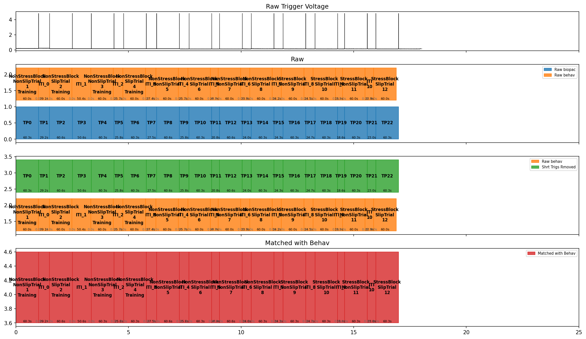

# Interval QC Plot

[Pipeline Rules](pipeline-rules.md) covered how the pipeline finds and
matches each participant's *files*. Once the right files are found, there's
a second matching problem: lining up *time* between two independent
sources — the physiology recording and the behaviour file — for each trial.
This page explains the plot the pipeline can produce to sanity-check that.

## What is a "trial interval"?

A **trial interval** is just a named span of time in the experiment — a
start second and an end second, with a label saying what happened during
that span (e.g. `"Baseline"`, or a specific trial's name). Physiology data
gets sliced up using these: "give me only the EDA signal between this
interval's start and end" (see [EDA & SCRs](eda.md)).

In code, a whole set of these is one `TrialIntervals` object
(`processing/trial_intervals.py`). Its docstring says it plainly:

```python
@dataclass
class TrialIntervals:
    """
    Trial intervals are named time periods in the experiment at the subject level, encoded
    as (start, end) time pairs keyed by a str name.

    For example:
    "Baseline": (0, 5) — the "Baseline" trial spans from 0 to 5 seconds.
    """

    intervals: dict[str, tuple[float, float]] = field(default_factory=dict)
```

Strip away the class, and it's really just a `dict`:
`{"Baseline": (0, 5), "Stress": (5, 65), ...}`. The class wraps that dict
and adds behaviour on top — keeping it sorted by start time, filling gaps,
relabelling, comparing two sets of intervals — which is why the pipeline
passes `TrialIntervals` objects around instead of bare dictionaries.

### Toy example: creating one yourself

You can build one directly, with made-up values, to get a feel for the
shape — no recording data needed:

```python
from mooi_toolbox.processing.trial_intervals import TrialIntervals

my_intervals = TrialIntervals(
    intervals={
        "Baseline": (0.0, 60.0),
        "Stress": (60.0, 120.0),
        "Recovery": (120.0, 180.0),
    }
)

len(my_intervals)       # 3 — one per named interval
my_intervals.intervals  # the underlying dict, always kept sorted by start time
```

### Real example 1: unlabelled, straight from trigger pulses

`TrialIntervals.from_raw_interval_pairs` is a shortcut constructor for
when all you have is a plain list of `(start, end)` pairs, with no
meaningful names yet — exactly the situation right after detecting raw
trigger pulses, before anything's matched to behaviour:

```python
from mooi_toolbox.processing.trial_intervals import TrialIntervals

raw_pairs = [(0.0, 60.0), (60.0, 120.0), (120.0, 180.0)]
unlabelled = TrialIntervals.from_raw_interval_pairs(raw_pairs)
# {"TP0": (0.0, 60.0), "TP1": (60.0, 120.0), "TP2": (120.0, 180.0)}
```

That `TP0`, `TP1`, … naming is exactly what labels the blue **"Raw
biopac"** row in the example plot below — this constructor is what
produces it.

### Real example 2: labelled, straight from behaviour data

Compare that to `get_crane_trigger_behav_intervals`
(`crane_trial_intervals.py`), which builds a `TrialIntervals` from a
participant's behaviour dataframe instead, using real trial names:

```python
def get_crane_trigger_behav_intervals(validated_behav_df: pd.DataFrame) -> TrialIntervals:
    intervals_out = {}
    for _, row in validated_behav_df.iterrows():
        intervals_out.update(
            {
                f"{row['BlockType']}_{row['TrialType']}_{row['TrialNr']}": tuple(
                    [row["TrialStartTime"], row["TrialEndTime"]]
                )
            }
        )
    return TrialIntervals(intervals=intervals_out)
```

This is what produces names like `NonStressBlock_NonSlipTrial_1` — visible
labelling the orange **"Raw behav"** row below. Matching *this* object
against the unlabelled one above (correcting for clock drift along the
way) is exactly what the rest of this page is about.

### Real example 3: what the matched result actually contains

Running the full matching step (`CraneGetTrialIntervalStrategyStep`) on
the synthetic `DUMMY000` participant's raw, pre-BIDS output in `examples/`
(see [Testing](testing.md#the-examples-folder)) produces a `TrialIntervals`
with 23 entries — this is `.intervals`, first five shown:

```
{
    'NonStressBlock_NonSlipTrial_1_Training': (4.9845, 65.3135),
    'ITI_0': (65.3135, 94.522),
    'NonStressBlock_SlipTrial_2_Training': (94.522, 155.1415),
    'ITI_1': (155.1415, 205.774),
    'NonStressBlock_NonSlipTrial_3_Training': (205.774, 266.104),
    ...
}
```

This is exactly the object drawn as the **red "Matched with Behav"** row
in the example plot below — real trial names, timestamps corrected onto
the trigger channel's clock.

## Why this exists

Trial timing comes from two places that don't share a clock:

- The **Biopac trigger channel** — a hardware voltage pulse sent at each
  trial boundary during recording. This is the physiology data's own
  timeline.
- The **behaviour file** — trial start/end times on the VR/task software's
  own clock.

These two clocks can drift apart over a session (see
[Clock Drift Notes](clock_drift_error.md)). Before physiology data can be
sliced into per-trial intervals, the pipeline has to detect, clean, and
match trigger pulses against behaviour trial times. That work happens in
`CraneGetTrialIntervalStrategyStep` (`processing/crane_trial_intervals.py`),
and it can produce the QC image below via `plot_biopac_interval_qc`
(`processing/trial_intervals.py`) so a human can check the result.

## Example



*(Generated from `DUMMY000`, the synthetic clean participant's raw,
pre-BIDS output produced by `examples/` — see
[Testing](testing.md#the-examples-folder) for how to generate it locally,
and how it now also gets converted to BIDS. No real participant data was
used to produce this plot.)*

## Row by row

| Row | Title | What it shows | Produced by |
| --- | --- | --- | --- |
| 1 | *Raw Trigger Voltage* | The raw analog trigger channel, straight from the recording. Each spike is one voltage pulse marking a trial boundary. | `get_biopac_raw_trigger_signal` |
| 2 | *Raw* | **Blue** (`Raw biopac`): every trigger interval detected before any cleanup (`TP0`…`TP22`, one per detected pulse pair). **Orange** (`Raw behav`): trial intervals straight from the behaviour file, labelled by block/trial name, with training and ITI (inter-trial interval) gaps shown. | `get_raw_biopac_trigger_intervals`, `get_crane_trigger_behav_intervals` |
| 3 | *(unlabelled)* | **Green** (`Shrt Trigs Rmoved`) vs. the same **orange** `Raw behav` row: trigger intervals after known-false/too-short triggers are dropped, gaps are filled, and a spurious extra trigger from a delayed experiment start is removed. Compare against the row above/below to check the cleaned trigger count now roughly matches the behaviour file. | `get_biopac_trigger_intervals_pipeline` — chains `remove_biopac_known_false_triggers`, `fill_in_gaps`, `remove_crane_delayed_start` |
| 4 | *Matched with Behav* | **Red**: the final result — trigger intervals corrected for clock drift and labelled with their actual trial names from the behaviour file. This is the `TrialIntervals` object physiology processing actually uses. | `align_biopac_trigger_drift_from_behav_file` |

!!! note "Going further"
    Row 1's "Raw Trigger Voltage" is also where a known open issue lives:
    voltage dips below ~4.8V are suspected to cause spurious double
    triggers, but aren't flagged on this plot yet — see item 15 in
    [Next Steps](pipeline_next_steps.md#15-double-triggers-still-causing-problems).

## The two strategies behind this plot

`crane_trial_intervals.py` defines two strategy steps (see
[Design Patterns](design-patterns.md) for what "strategy step" means here):

- **`CraneGetTrialIntervalStrategyStep`** — the main path. Needs *both*
  physiology and behaviour data, and produces all four rows above,
  including a filled-in "Matched with Behav" row. The example above is
  from this path.
- **`CraneGetTrialIntervalStrategyFallbackStep`** — set as the main step's
  `fallback_strategy`, and used when matching against behaviour data fails
  (see [Pipeline Rules](pipeline-rules.md#missing-files-dont-stop-the-pipeline)
  and item 5 in [Next Steps](pipeline_next_steps.md#5-add-a-fallback-for-partialmissing-behaviour-data-using-unlabelled-intervals)).
  It only has trigger data to work with, so its version of this plot only
  fills rows 1–3 — the "Matched with Behav" row stays empty, and physiology
  is processed against unlabelled trigger intervals instead.

!!! note "Going further"
    A dedicated, interactive version of this QC step — for flagging
    questionable trigger/behaviour matches by hand instead of only viewing
    a static image after the fact — is being planned; see
    [Interactive QC Plan](crane_interactive_qc_plan.md) and item 9 in
    [Next Steps](pipeline_next_steps.md#9-manual-qc-tool-for-clock-drift-verification).

## Why FOH doesn't need any of this

All of the above — trigger detection, false-trigger filtering, clock-drift
correction, behaviour matching — exists because Crane's physiology and
behaviour data come from **two independent clocks** that have to be
reconciled after the fact. FOH's LSL/`.xdf` recordings don't have that
problem: every stream in an `.xdf` file is already time-aligned to one
shared clock at recording time (see
[Lab Streaming](lab-streaming.md#what-is-lsl-and-whats-a-xdf-file)), so
`FohGetTrialIntervalStrategyStep` builds its `TrialIntervals` directly from
named LSL events — no trigger channel, no drift correction, and (so far)
no equivalent of this QC plot. See
[Lab Streaming: building trial intervals from LSL events](lab-streaming.md#building-trial-intervals-from-lsl-events-foh_configpy)
for how that step works instead.

---

**Next: [EDA & SCRs](eda.md)** — now that trial intervals are matched, see
what actually happens to the physiology signal inside each one.
