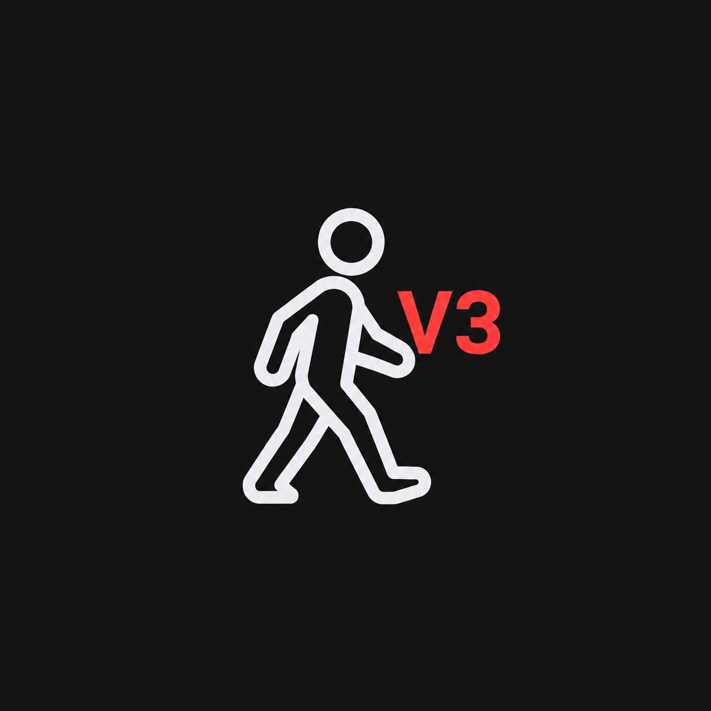

# LongwalkV3 Crosscheck

{ width="72" }

This is step 1: before your data can be [processed](processing.md), your
raw recordings need to be converted into BIDS and crosschecked. This page
is for anyone using the LongwalkV3 Crosscheck tool to do that — no coding
background needed. If you haven't already, read
[Crosschecking](crosschecking.md) first — it covers what crosschecking
means and why it matters in general; this page picks up from there with
what's specific to LongwalkV3 and the actual walkthrough.

!!! info "The raw folder is never changed — not once, not ever"
    Worth repeating here: nothing on this page ever writes to, renames, or
    deletes anything in your **raw folder**. See
    [Crosschecking](crosschecking.md#what-is-crosschecking) for the full
    explanation of why that's safe.

## Why LongwalkV3 is different from Crane/FOH crosscheck

If you've used [Crane Crosscheck](crane-crosscheck.md) or [FOH
Crosscheck](foh-crosscheck.md) before, there's one important difference:
those tools expect **exactly one** recording per subject per file type, so
finding two counts as a problem — a duplicate you have to resolve by
picking the real one and discarding the rest.

LongwalkV3 doesn't work that way. A participant can do up to **3 real
sessions** (separate real-world days), and within a session there can be
**several real events files** — one per city/run combination. Finding
several physiology recordings or several events files for one subject is
completely normal, not a duplicate. So this tool treats every physiology
and events file it finds as legitimate and shows you all of them side by
side — there's no "pick the right one, delete the others" step here the
way there is for Crane or FOH.

!!! warning "This means the tool can't catch an accidental raw duplicate on its own"
    Because every matching file is treated as legitimate, if a session
    genuinely got exported twice by mistake, the tool won't flag it as a
    problem the way it would for Crane/FOH — it'll just show up as one
    more normal-looking recording. If you suspect that's happened for a
    subject, use **"Fix Filenames in Raw Folder"** (below) or **Reveal**
    to look at the raw files yourself before running **Refresh BIDS**.

## How to do a crosscheck

!!! tip "Not sure what a button or icon does?"
    Hover your cursor over any icon or button in the tool — a short
    tooltip explains what it does before you click it.

### 1. Open the tool

With the toolbox installed (see [Getting
Started](getting-started.md) if you haven't done this yet), open a
terminal and type:

```bash
vrlab_longwalk3_bids_crosscheck
```

The tool remembers the last BIDS folder you had open, so after your first
time using it, it'll usually open straight to where you left off.

### 2. Point it at your raw folder and import

Click **Browse...** next to **Raw Folder** and select the folder your raw
LongwalkV3 recordings actually land in, then click **Refresh BIDS**. This
copies every subject not already in your BIDS folder across; subjects
already imported are never re-copied, overwritten, or even looked at
again, so a crosscheck decision you've already made can never be
clobbered by re-running this. Nothing in the raw folder is ever changed
or deleted by this step. Safe to click any time, including repeatedly.

**Reveal** next to the raw folder opens it in your system's file browser
(Explorer on Windows, Finder on macOS) — handy if you want to look at
what's actually in there yourself.

Every raw physiology (`.acq`) or behaviour/actor-log (`.csv`) file's
subject id is normally read straight from its filename. Occasionally that
fails outright, or it succeeds but lands on the wrong id. Click **"Fix
Filenames in Raw Folder"** to see every raw file of either kind in one
table, with a **"Currently resolves to"** column showing the subject id
it currently maps to (or **"(unparseable)"**, in red, if it doesn't
resolve at all). Click a row to see, in the details pane below the table,
plain-English reasoning for why it failed (or what it resolves to if it
didn't), plus any matching line from the last time you ran **Refresh
BIDS**. Type the correct subject id into **"Corrected subject id"** for
any row that's wrong, then click **Save**. This never renames the raw
file itself — only what the *next* Refresh BIDS run resolves that
filename to.

### 3. Point it at your BIDS folder

If nothing loads automatically, click **Browse...** in the **BIDS
Folder** panel and select your LongwalkV3 BIDS folder — the destination
folder from step 2 above, not the raw one. This is the folder every step
from here on actually works with. **Reveal** opens it in your system's
file browser, same as the raw folder's.

**Study ID** is a short label for this study, saved inside the BIDS
folder and remembered next time you open it — it's what names your saved
crosscheck data (see [Backing up](#backing-up-and-rebuilding-after-a-lost-bids-folder)
below), so a backup stays identifiable. Pick an existing one from the
dropdown if you're pointing the tool at a different copy of a study
you've already worked on.

### 4. Read the subject list

The **BIDS folder summary** panel gives you the folder's overall state at
a glance — total subject count, how many physiology/events files were
found — and, in **bold red**, how many subjects still need crosschecking
(i.e. haven't been marked ☑). That count disappears once everyone's been
reviewed.

The left-hand panel lists every subject, with a small icon (or icons)
next to each one telling you, at a glance, whether it needs your
attention:

| Icon | Meaning |
| --- | --- |
| ● | Fine — one or more files found (normal for LongwalkV3, see above), nothing missing. |
| ○ | Missing — no file found at all for this scan type. |
| ☑ | You've personally reviewed and approved this one. |
| ❗ | An events file couldn't be read, or is missing its expected `onset` column — worth a look before you rely on it. |

!!! note "No ⚠ (duplicate) or 🏷 (needs tagging) icons here"
    You won't see either of these for LongwalkV3. ⚠ doesn't apply because
    this tool never treats multiple physiology/events files as a
    duplicate needing a pick (see [above](#why-longwalkv3-is-different-from-cranefoh-crosscheck)).
    🏷 doesn't apply either — LongwalkV3's raw-to-BIDS step already writes
    real BIDS filenames itself, so there's no separate tagging step the
    way FOH has.

Tick **Issues only** above the list to hide every subject that's already
fine, so you only see the ones missing data or flagged with ❗.

### 5. Click a subject to see its details

The right-hand panel shows full detail for whichever subject is selected
on the left — every physiology file and every events file found for
them, each listed with its own info, individually correctable (see step
6). You can also select more than one subject at once (Ctrl-click or
Shift-click) for the bulk actions in [Working with several subjects at
once](#working-with-several-subjects-at-once) below.

The **Physiology** panel lists one row per `.acq` file found — normally
one per real session. No content is read from these files (channel
checks aren't available for this raw format yet), so each row just shows
the filename with a ✓.

The **Events** panel lists one row per events file found — one per
session/city/run. Each row shows its row count and a ✓/✗ for whether it
read cleanly and has the `onset` column every events file needs; hover
the ✓/✗ for more detail.

### 6. Look at the files, or fix a wrong date

Click **"Reveal subject folder"** next to any file to open that
subject's folder — inside your **BIDS folder**, not the raw one — in
your system's file browser.

If a file's recorded acquisition date is wrong, click **"Correct
date..."** next to it and type the right one — this rewrites the date in
that session's `scans.tsv` (see step 8), not the filename itself.

### 7. Mark a subject as reviewed (optional)

Above the file details, the **Subject Actions** panel holds actions that
apply to the whole subject: marking it reviewed, renaming its ID,
re-reading its info from disk if a file has changed since the tool last
looked (**Refresh**), undoing crosscheck bookkeeping (**Restore from
raw...**), and removing it from BIDS entirely. It stays visible at a
fixed spot regardless of what's selected — blank when nothing is
selected, and titled with the subject's ID when exactly one is.

Click **"Mark crosschecked"** to record that you've personally looked at
this subject and approved it — shown afterwards as a ☑ next to its name
in the subject list. This is a manual note for your own or your team's
reference; it doesn't change anything else. Click the same button again
("Un-mark crosschecked") to remove the mark.

- **Rename subject ID...** — corrects a wrong subject id, renaming the
  `sub-<id>` folder and every file inside it to match.
- **Restore from raw...** — clears this subject's crosscheck bookkeeping,
  so the next **Refresh BIDS** re-derives their whole record fresh from
  the raw folder. Any other decision already made for them (a corrected
  date, a crosschecked mark) goes with it and needs redoing too.
- **Remove Subject Folder from BIDS...** — deletes the subject's entire
  folder from BIDS (their raw recording is untouched) and asks for an
  optional reason first. This one has no in-app undo — your raw folder,
  untouched by this tool, is the only way back.

### 8. scans.tsv

Below the file details, the **scans.tsv** panel lists every scan this
subject's BIDS bookkeeping currently knows about, with its recorded date.
**Edit date...** next to any row lets you correct that scan's date
directly, without needing to find its file in the panels above first.

### 9. Activity Log

A running record of everything the tool has done this session — what
**Refresh BIDS** found, when auto-save last ran, and so on.

## What about "Remove non-selected files from BIDS"?

You'll see this button near the top of the window, same as Crane/FOH
Crosscheck — but for LongwalkV3 it will almost always stay disabled or
show "0 picks." That's expected: this button commits a *duplicate pick*,
and, as explained above, physiology and events files are never treated
as duplicates here. It only comes into play if a future scan type added
to this tool doesn't allow multiple files the way physiology/events do.

## Working with several subjects at once

Select more than one subject in the list and **Subject Actions** switches
to a **Group Actions** panel: bulk versions of the same buttons, scoped
to your selection — **Refresh**, **Mark selected crosschecked** /
**Un-mark selected crosschecked**, **Restore selected from raw...**, and
**Remove selected from BIDS...**.

**Renaming a subject's ID** stays single-subject only, on purpose —
renaming several different subjects to the same new ID wouldn't make
sense.

## Backing up, and rebuilding after a lost BIDS folder

This is the payoff of the rule at the top of this page — **the raw folder
is never touched** — spelled out concretely: everything in your BIDS
folder is either raw data (already safe, and reproducible any time by
re-running **Refresh BIDS**) or bookkeeping this tool writes as you work.
Only that bookkeeping is unique and worth backing up on its own — use
**Save Crosscheck Data** / **Restore Saved Crosscheck Data** in the
**General Actions** panel, keyed automatically to this BIDS folder's
Study ID. **Save**/**Restore Crosscheck Data** for LongwalkV3 also cover
the raw-filename correction file from step 2 (**Fix Filenames in Raw
Folder**) automatically, since a rebuild needs it in place *before*
Refresh BIDS runs, not just the decisions made afterward.

---

**Next: [Process Your Data](processing.md)** — step 2, once your data's
the right files in the right place.

**Also see:** [Crosschecking](crosschecking.md) for what crosschecking
means in general, [Crane Crosscheck](crane-crosscheck.md) and [FOH
Crosscheck](foh-crosscheck.md) for the equivalent tools for other
datasets, and [BIDS Crosscheck: Architecture](bids-crosscheck-architecture.md)
if you're looking to change how the tool works rather than just use it.
